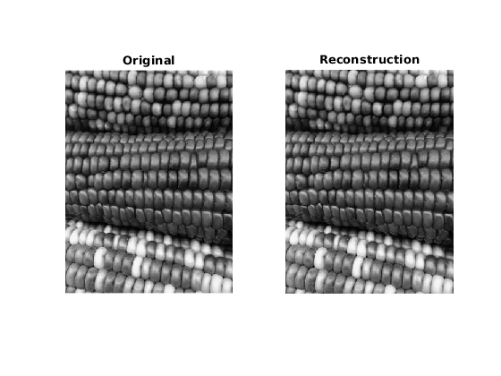
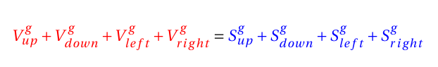
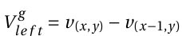
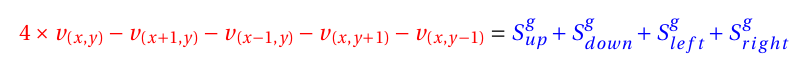
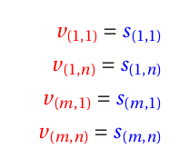
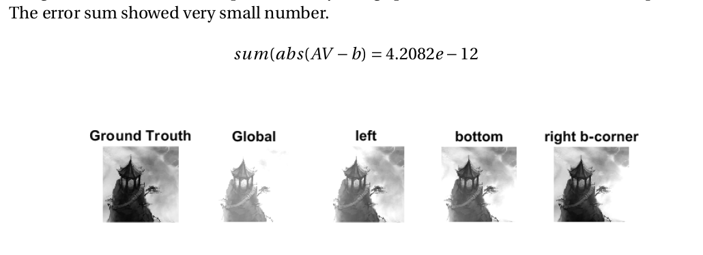

# Image-Reconstruction
Image Reconstrucntion by referring to its second order deriatives

### Prerequisites

This project is tested on MATLAB 2018

```
MATLAB2018 
```

### Run
```
image_reconstruction 
```
## Result

\
Image reconstruction is implemented by using Sparse matrix to solve the linear equation\
\
where V is the reconstructed image and S is the source image.
Also,  for each pixel. \
Thus, the equation we need to solve is, \
\
The red is variables and the blue is constant, so we have AV=b (if we have n pixels, A is nxn, V is nx1, and b is nx1) 
For edge pixels, they have either horizontal or vertical second-order deriatives. \
For corner pixels, there are no second-order deriatives, which we fail to solve the equation for all the pixels. \
Therefore, we need to apply the contraints of gloabl lightness and global gradients as below, \
\
Thus, the dimension of our equation AV=b is (n+4)xn for A, nx1 for V, and (n+4)x1 for b. \
Also, based on the constraints settings, we can see the differnet brightness as below, 



## Author

Suhong Kim – [@github](https://github.com/suhongkim) – suhongkim11@gmail.com \
Distributed under the MIT license. See the [LICENSE.md](LICENSE.md) file for details
